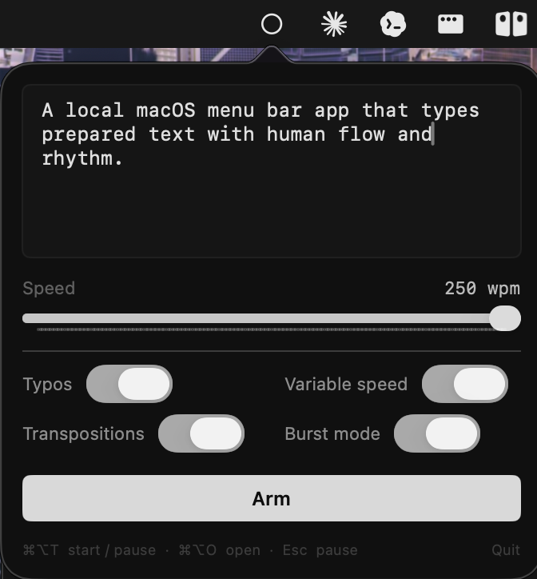

# TypingBot

A local macOS menu bar app that types prepared text with human flow and rhythm.

The app lets you paste a block of text, arm it, and have the app type it for you - letter by letter. Good for cheating, but only if you already have the text prepared. 


## Features
- "Absorbs" the keyboard, so you can type random things and they won't appear on screen (except the hotkeys, obviously)
- Global hotkeys:
  - `Cmd+Opt+O` opens the control panel.
  - `Cmd+Opt+T` starts, pauses, and resumes typing.
  - `Esc` emergency-pauses typing.
  - `Esc` twice hard-resets the run so the next start begins from the top.
- Human-like typing simulation:
  - Configurable typing speed.
  - Easy words type faster.
  - Harder words type slower and can be more error-prone (but the bot autocorrects itself, just like we humans do).
  - Higher speeds produce fewer typos.
  - Optional corrected typos and transpositions.
- Native macOS permissions flow for Accessibility and Input Monitoring.
- Minimal menu bar UI with local settings persistence.

## Screenshot



## Install

Download `TypingBot-macOS.zip` from the [Releases](https://github.com/Euler2718e/typingbot/releases) page.

1. Download `TypingBot-macOS.zip`.
2. Unzip it.
3. Open `TypingBot.app`.
4. If macOS blocks the app on first launch, right-click `TypingBot.app` and choose `Open`.
5. Grant Accessibility and Input Monitoring when prompted.

TypingBot needs those permissions because macOS protects global keyboard listeners and apps that type into other apps. Accessibility allows TypingBot to send keystrokes. Input Monitoring allows TypingBot to listen for global hotkeys like `Cmd+Opt+T`.

## Usage

1. Press `Cmd+Opt+O` to open the panel.
2. Paste or type the text you want TypingBot to write.
3. Adjust speed and typo settings.
4. Click `Arm`.
5. Focus the app and text field where the text should go.
6. Press `Cmd+Opt+T` to start.

While TypingBot is running, it suppresses physical key presses so accidental keyboard input does not interfere with the generated text. Press `Esc` once to pause. Once paused, everything you type will appear on screen. Press `Esc` again while paused to reset the run to the beginning.

## Build From Source

Requirements:

- macOS 13 or newer
- Xcode Command Line Tools
- Swift Package Manager

Clone and build:

```bash
git clone https://github.com/Euler2718e/typingbot.git
cd typingbot
./build_mac.sh
open dist/TypingBot.app
```

The build script compiles the Swift package, assembles a `.app` bundle in `dist/`, and applies an ad-hoc code signature so macOS can track the app consistently in Privacy & Security settings.

## Architecture

TypingBot is a small native macOS app:

- AppKit owns the menu bar lifecycle and permission setup window.
- SwiftUI renders the popover control panel.
- CoreGraphics event taps handle global hotkeys and keyboard suppression.
- Synthetic `CGEvent`s type the prepared text into the focused app.
- `HumanSim` controls timing, speed variation, corrected mistakes, transpositions, and word difficulty behavior.

## Privacy

- No analytics.
- No network calls.
- No server.
- Your prepared text stays on your Mac.
- Accessibility and Input Monitoring are used only for global hotkeys, keyboard suppression, and typing into the focused app.

## License

MIT
