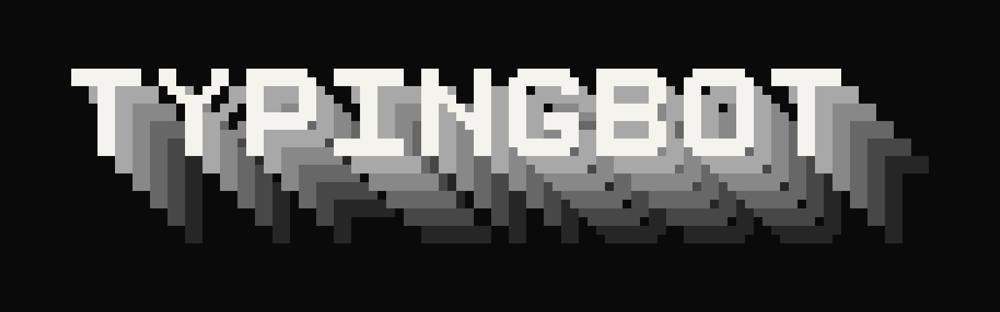

<div align="center">
  
</div>

# TypingBot

TypingBot is a local desktop app that plays a visible planning, drafting, and revision process into any focused text field. You give a language model one strict prompt, paste its JSON response into TypingBot, choose a duration and average speed, then run the performance offline.

It is built for writing demonstrations, accessibility workflows, rehearsals, and screen recordings. It is not proof of human authorship and should not be used to misrepresent work or bypass academic or workplace rules.

## What it does

- Runs on macOS, Windows, and Linux through Tauri.
- Types into ordinary desktop and browser text fields.
- Shows rough lowercase planning before the main draft.
- Supports append, exact replacement, deletion, movement, clearing, and timed rereading.
- Divides the session into planning, drafting, and polishing budgets.
- Varies speed with short bursts, hesitation, punctuation pauses, and corrected transient typos.
- Simulates every edit locally and requires an exact match with the supplied final text.
- Locks onto the destination application and pauses when focus changes.
- Provides `Cmd/Ctrl + Alt + Space` as a global pause and resume shortcut.
- Makes no network requests and does not require an account.

## Install

### Normal installation

1. Open the repository's **Releases** page.
2. Download the newest file for your computer:
   - macOS Apple Silicon: the `aarch64.dmg`
   - macOS Intel: the `x64.dmg`
   - Windows: the `.msi` or setup `.exe`
   - Linux: the `.AppImage` or `.deb`
3. Open the download and install TypingBot.
4. On macOS, grant Accessibility permission when prompted. On Linux, input simulation is most reliable in an X11 session.

Unsigned development releases can trigger an operating-system warning. Signing instructions are tracked separately from the application and require platform developer certificates.

## Use

1. Open TypingBot from the system tray or menu bar.
2. Paste your assignment or writing brief into **Writing request**.
3. Select **Copy prompt** and send the copied text to ChatGPT, Claude, Gemini, or another capable model.
4. Copy only the JSON object returned by the model.
5. Paste it into **Model output** in TypingBot.
6. Choose the total duration, average WPM, countdown, and phase percentages.
7. Select **Validate and play**.
8. During the countdown, focus the destination textbox.

TypingBot hides its window, captures the foreground application as the destination, then begins. Switching to another application pauses the session. Refocus the original application and use `Cmd/Ctrl + Alt + Space` or the app controls to resume.

Physical keyboard input is never blocked. Do not type into the destination during playback because TypingBot cannot reliably inspect arbitrary third-party textbox contents.

## Performance language

The model returns a constrained JSON document rather than raw keyboard instructions. Anchors must be unique at their exact step, actions cannot execute code, and the final simulated document must exactly equal `finalText`.

Read the [performance-format reference](docs/performance-format.md) or open the [complete example](examples/demo.performance.json).

## Privacy and security

- Prompt construction happens in the desktop UI.
- TypingBot contacts no model and has no HTTP dependency.
- Pasted scripts and settings are stored only in the local WebView profile.
- Scripts cannot access the filesystem, shell, clipboard, or network.
- Physical keystrokes are not recorded, absorbed, or transmitted.
- Focus loss pauses external input before the next action.

## Build from source

Requirements: [Bun](https://bun.sh/), stable [Rust](https://rustup.rs/), and the [Tauri system prerequisites](https://v2.tauri.app/start/prerequisites/) for your operating system.

```bash
git clone https://github.com/Euler2718e/typingbot.git
cd typingbot
bun install
bun test
bun run tauri build
```

Development mode:

```bash
bun run tauri dev
```

## Architecture

- `src/core/` defines prompt generation and deterministic browser-side validation.
- `src-tauri/src/model.rs` repeats security-critical validation at the native boundary.
- `src-tauri/src/session.rs` owns timing, focus locking, pause control, and the internal document mirror.
- `src-tauri/src/input.rs` translates safe edit operations into local keyboard events.
- `.github/workflows/` tests all desktop platforms and creates draft installer releases.

The reasoning behind the composition and platform choices is summarized in [design research](docs/research.md).

## License

MIT
